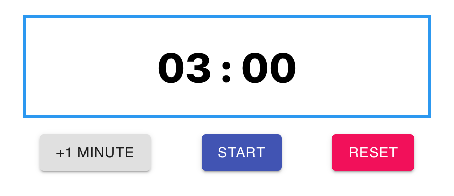
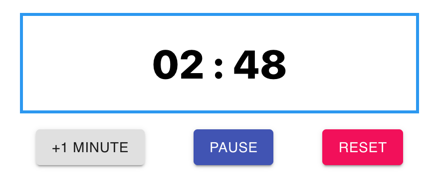
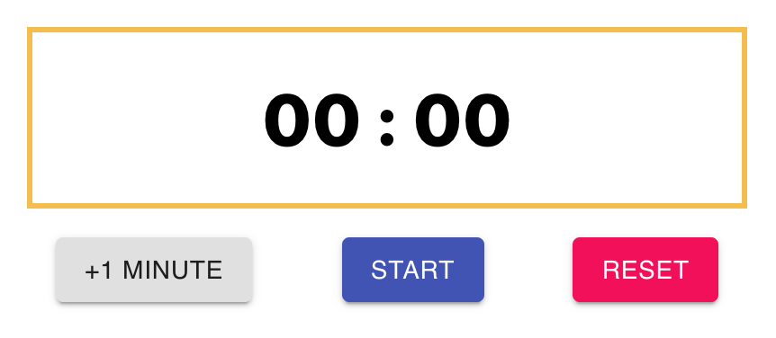
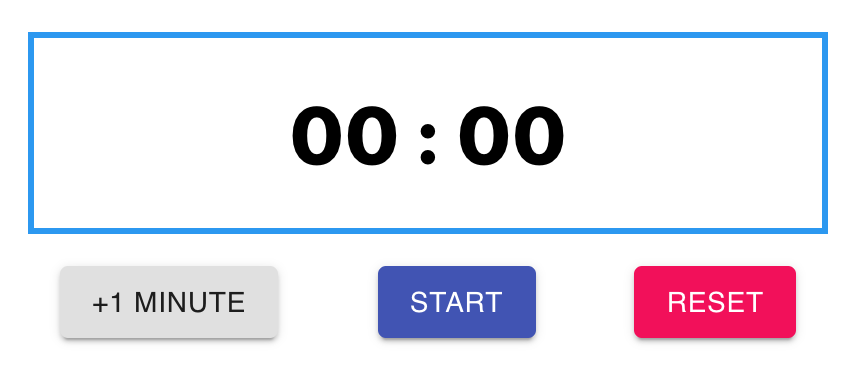

# Countdown Timer using React Hooks

## Features

1. The timer counts down in minutes and seconds. You can increase the number of minutes to a maximum of 99 minutes.
2. Timer is initialized to 00:00. Clicking Reset will pause any timer and re-initialize the timer to 00:00.
3. Clicking +1 Minute will add a minute to the current timer. This is the only way to increase the time on the timer. You can add time while the timer is paused, or while it’s running.
4. Clicking start will start counting down the timer. Clicking Pause will freeze the timer and clicking Start again will resume it.
5. When the timer runs out, it should stop at 00:00 and the border should change, as in the mocks below. When the timer is reset (or initialized) it should not be orange, even though the counter will be 00:00.
6. While running, the seconds should decrease by 1 every second.

### Timer for 3 minutes

### Timer running

### Timer finished

### Timer reset

